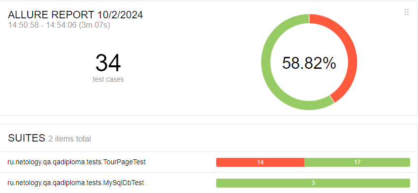

# Отчёт о проведённом тестировании приложения aqa-shop
По завершении тестирования был сформирован отчёт в Allure, сформированный в [Github Pages](https://nshabankin.github.io/qa-diploma/). Данный отчёт содержит подробное описание, основанное на нём.
---

## 1. Краткое описание

---

Для тестирования приложения были выбраны два направления:
1. Тестирование UI: 
   1. Критические пути пользователя для покупки туров по дебетовой карте и в кредит, со статусом `APPROVED` и статусом `DECLINED`.
   2. Поля формы ввода данных карт: ввод валидных, разных типов невалидных и пустых значений.
   3. Отображение заголовка страницы с информацией о предложенном туре.
2. Тестирование корректности записей в БД:
   1. Наличие записей о совершенных транзакциях в таблицах БД.
   2. Отсутствие в столбцах записей информации о введенном номере карты.
   3. Корректное отображение суммы транзакции в зависимости от стоимости тура.

## 2. Количество тест-кейсов

---

1. Проверка видимости элементов страницы, содержащих информацию о туре: 1 тест-кейс.
2. Успешная покупка тура по карте со статусом `APPROVED`, по дебетовой карте и в кредит: 2 тест-кейса.
3. Неуспешная покупка тура по карте со статусом `DECLINED`, по дебетовой карте и в кредит: 2 тест-кейса.
4. Ввод значений в поле "Номер карты" и проверка сообщений об ошибке: 4 тест-кейса.
5. Ввод значений в поле "Месяц" и проверка сообщений об ошибке: 6 тест-кейсов.
6. Ввод значений в поле "Год" и проверка сообщений об ошибке: 6 тест-кейсов.
7. Ввод значений в поле "Имя владельца" и проверка сообщений об ошибке: 6 тест-кейсов.
8. Ввод значений в поле "CVC/CVV" и проверка сообщений об ошибке: 4 тест-кейса.
9. Проверка содержания записей в таблицах MySQL БД: 3 тест-кейса.

Общее количество тест-кейсов: 31 UI тест-кейс, 3 БД тест-кейса. Всего 34 тест-кейса.

## 3. Процент успешных и неуспешных тест-кейсов.

---

- Процент успешных тест-кейсов: 58.82%. 20 из 34.
- Процент неуспешных тест-кейсов: 41.17%. 14 из 34.

Основные, наиболее критичные неуспешные тест-кейсы связаны с тем, что пользовательский интерфейс приложения не реагирует ожидаемым образом на:
1. Попытку оплатить тур заблокированной картой (со статусом `DECLINED`, известным заранее). Ожидаемым поведением было бы сообщение об ошибке.
2. Различные невалидные типы значений в поле "Имя владельца" (пропускаются значения, содержащие кириллицу или цифры). Ожидаемым поведением было бы сообщение об ошибке.

Остальные неуспешные тест-кейсы связаны с тем, что пользовательский интерфейс приложения не реагирует единообразно на:
1. Поля с пустыми значениями. Ожидаемым поведением было бы сообщение об ошибке с текстом "Поле обязательно для заполнения". Фактическое поведение: сообщение с текстом "Неверный формат", таким же, как в ответ на невалидные значения поля.
2. Поле "Месяц" с истёкшим значением. Ожидаемым поведением было бы сообщение об ошибке с текстом "Истёк срок действия карты", такое же, как в ответ на заполнение поля "Год" истёкшим значением. Фактическое поведение: сообщение с текстом "Неверно указан срок действия карты".

## 4. Общие рекомендации

---

Тест-план работы над проектом предполагал старательное покрытие тестами функционала приложения и записи в БД. 

Тем не менее остается пространство для:
- Дополнительных возможных вариантов невалидных значений поля "Имя владельца": содержащие несколько пробелов, специальные символы, слишком короткие или длинные значения. Это позволит отсечь более широкий набор невалидных значений, если их проверка системой будет дополнена.
- Проверки валидности срока действия карты в зависимости от текущей даты. На данный момент срок действия проверяется при помощи заранее введённых, нежели вычисленных от текущей даты, данных из набора в файле `form_test_data.csv`. Это позволит не зависеть от даты проведения тестов.
- Проверки наличия номера любой карты в записях БД, например, при помощи регулярных выражений. На данный момент тесты проверяют наличие конкретных, назначенных заранее, тестовых данных карт. Это позволит проверять содержание номеров карт вне зависимости от тестовых данных.
- Более детальной проверки видимости элементов заголовка тура: содержания текстов, отображения изображений, вычисления корректной стоимости и значения бонусных миль и т.д.